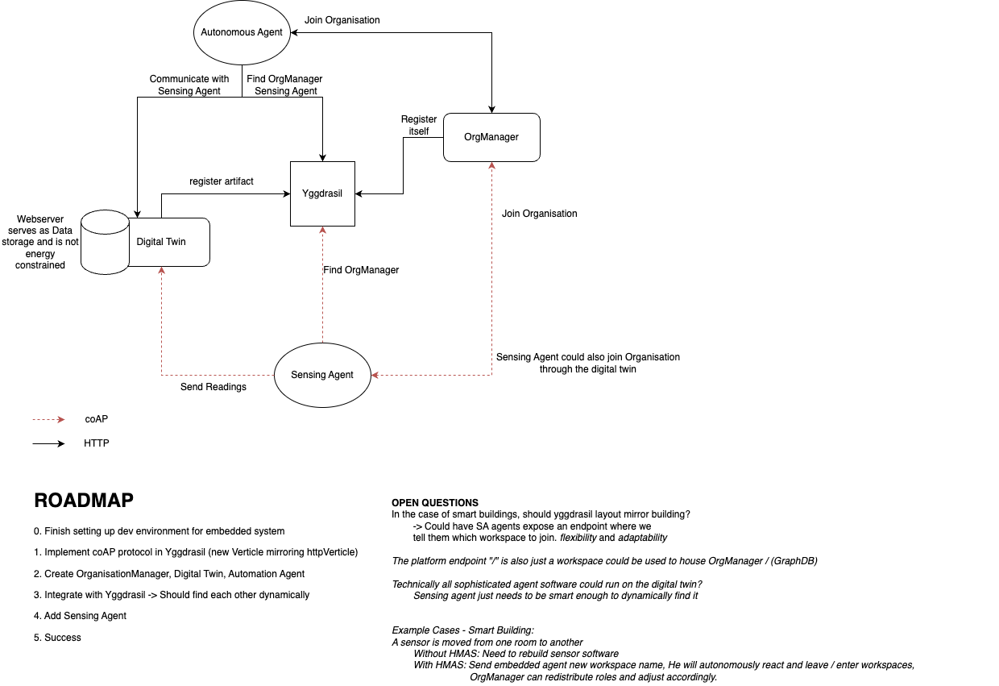

# IMP-Hypermedia-in-MicroWatts

## ROADMAP
The rough steps to make this project a success

- [ ] Finish setting up the embedded systems development environment
- [ ] Implement rudimentary Sensing Agent that dynamically registers itself with the organisation
- [ ] Implement Organisation Manager that adds itself to the Yggdrasil instance so it may be found
- [ ] Implement coAP functionality in Yggdrasil
- [ ] Create Digital Twins of embedded agents
- [ ] Increase complexity of embedded bdi agents
- [ ] Whole system dynamic and operable
- [ ] Add demos that illustrate flexibility and robustness of chosen architecture

### Yggdrasil TO-DOs
- [ ] Set up new vertx verticle that acts as coAP server
- [ ] Functionality shoud be same as over HTTP
- [ ] Add functionality to expand #platform representation so that e.g. orgManager is easily found

### Yggdrasil Roadblocks
- [ ] What to do with base uri ? If coAP agent disregards base Uri and just uses the paths it works. 
But that would mean that the agent cannot take the actual uris advertised in the representations.
- [ ] How should request payloads look like? /join uses http headers
- [ ] Should we add another representation factory that gives tds specifically for coap?

### loose ideas
- Yggdrasil doesnt need much added complexity except for coAP and custom #platform representation. The additional services such as orgManager and GraphDB / digital twins should all be standalone software that can register themselves on Yggdrasil through creating an artifact of themselves in the wanted workspace.
- Only hardcoded URI should be the entrypoint to yggdrasil (Digital Twin could be found through yggdrasil as well technically)
- Without digital twin embedded agent would register itself directly -> create a digital Artifact that has minimal initialization params so that the embedded agent does not need to send the entire graph string that is its own representation. OR simply set different rules for makingArtifact with coAP where we do not need a specialised artifact
- BLE Beacon to be used for location tracking of embedded agents. Could be used in order to enable easy moving of agents between different locations.
- Using the Agent body artifact to expose signifiers that point to the location of Data storage. There could be one central DB service that exposes a query endpoint and the agents would point to that endpoint, with each agent indicating in their representation what parameters must be used on the query endpoint to get the data they have stored.
- Could have a program sitting in network that listens for new devices joining and sends them location of yggdrasil endpoint -> requires a set endpoint for the agents to receive the yggdrasil endpoint -> like .well-known
- Could have a program that listens for new devices joining and sends them the location of the orgManager -> requires a set endpoint for the agents to receive the orgManager endpoint -> like .well-known -> would enable no hardcoding of even entrypoint
